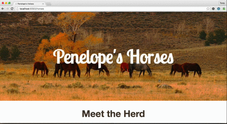
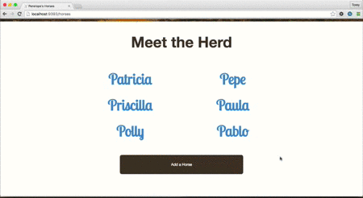
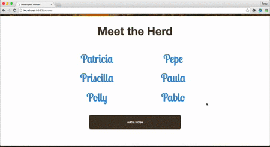

# Self-Assessment по AJAX(fetch)

## Общие сведения
Работая с releases, вы будете создавать различные запросы AJAX, а затем обновлять DOM в зависимости от ответа. Цель этой задачи – лучше понять ваше личное умение внедрять AJAX и определить области, в которых вы уже разбираетесь, и какие нужно подтянуть.

## Releases
### Pre-Release: Опишите AJAX
В файле `ajax-description.md` своими словами (1) опишите, что такое AJAX, и (2) напишите краткую инструкцию о том, как сделать запрос AJAX. Мы не требуем развернутых ответов, просто кратко опишите ваше понимание AJAX.

### Pre-Release: Изучите функциональное приложение 
У вас есть простое приложение с функционалом CRUD, которое позволяет Пенелопе следить за лошадьми. Настройте приложение, разберитесь с БД. После этого прочитайте предоставленный код и попереходите по ссылкам на сайте, чтобы понять, как он функционируют.

### Release 0: Динамическая загрузка формы 
Как Пенелопа добавляет новых лошадей в свое стадо в этом приложении? Ей необходимо перейти с начальной страницы на другую страницу, на которой находится форма. Она предпочла бы видеть непрерывный рабочий процесс, поэтому вам необходимо улучшить сайт с помощью AJAX. Не нужно изменять текущий функционал сайта, просто улучшите User Experience, добавив AJAX-запросы.

В первую очередь добавьте динамическую загрузку формы для создания новой лошади, когда Пенелопа нажимает кнопку «Добавить лошадь» (см. рис. 1). По мере необходимости вы можете редактировать код, добавляя любые идентификаторы, классы или частичные шаблоны, чтобы выполнить требования.

*Рисунок 1*. Добавление формы на начальной странице

### Release 1: Обновление страницы после подачи формы 
Пенелопа довольна нашим обновлением, но она просит еще одно обновление. Сейчас, когда она отправляет динамически загруженную форму, то переходит на новую страницу с новой лошадью. Она предпочла бы остаться на текущей странице и добавить новую лошадь в список лошадей (см. рисунок 2).

*Рисунок 2*. Добавление новой лошади в список.

### Release 2: Динамическая загрузка сведений о лошади
Пенелопе понравились наши обновления, поэтому она просит нас еще поработать над сайтом. Список лошадей содержит ссылки на страницы, которые показывают сведения о каждой лошади: имя, породу и возраст. Вместо перехода на новую страницу, Пенелопа хочет, чтобы при нажатии на имя лошади сведения загружались динамически (см. рисунок 3).

*Примечание:* Эта функция должна работать для лошадей, перечисленных в списке при начальной загрузке страницы, а также для лошадей, добавленных в список позже.

*Рисунок 3*. Отображение сведений о лошади.

### Release 3: Рефакторинг кода
Вы добавили все необходимые функции? Просмотрите свой код, можно ли добиться лучшей структуры JavaScript? Также перепроверьте обработчики маршрутов. Правильно ли написан их код? Они разрешают отвечать как на AJAX-запросы, так и на обычные HTTP-запросы из браузера?

## Заключение
Когда закончите, сделайте коммит, но не спешите синхронизировать (push) свою ветку с Github, пока не придет время.

Подумайте о том, как вы справились с задачей. Не забывайте, что эта задача является контрольной точкой, которая оценивает ваш прогресс работы с AJAX. В чем вы уже хорошо разобрались? В каких областях вам необходимо дополнить знания?

